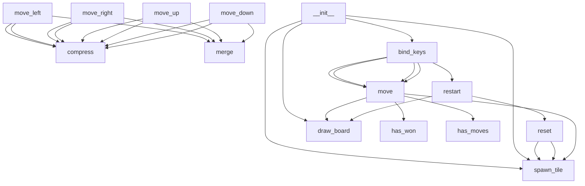

# Python Game Hub

A collection of 5 classic games built with Python tkinter. No external dependencies required.

## Games Included

| Game | Controls | Description |
|------|----------|-------------|
| **2048** | Arrow keys | Slide tiles, merge numbers, reach 2048 |
| **Snake** | Arrow keys / WASD | Eat food, grow longer, don't crash |
| **Tic-Tac-Toe** | Mouse click | Play vs AI opponent |
| **Pong** | Up/Down arrows | First to 5 wins against CPU |
| **Breakout** | Left/Right arrows | Smash all bricks to win |

## How to Run

```bash
python main.py
```

## Project Structure

- `main.py` - Game hub with menu and game launcher
- `game2048.py` - 2048 sliding tile puzzle
- `snake.py` - Classic snake game
- `tictactoe.py` - Tic-tac-toe with AI
- `pong.py` - Single player pong
- `breakout.py` - Brick breaker game

<!-- AUTODOCS:OVERVIEW:START -->
**Primary language:** Python

**Total files:** 3
<!-- AUTODOCS:OVERVIEW:END -->

<!-- AUTODOCS:API:START -->
_No API routes detected._
<!-- AUTODOCS:API:END -->

<!-- AUTODOCS:ARCHITECTURE:START -->

<!-- AUTODOCS:ARCHITECTURE:END -->
