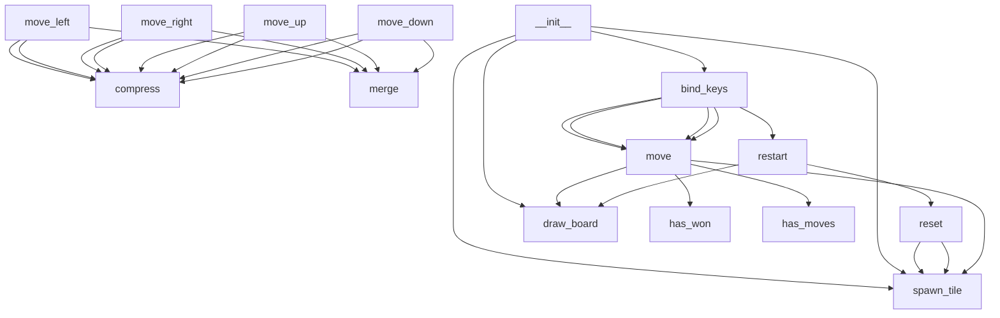

# 2048 Game

A fully functional 2048 puzzle game built with Python tkinter. Slide tiles, merge matching numbers, and reach 2048!

## How to Play

```bash
python game2048.py
```

- **Arrow keys** to move tiles (Left, Right, Up, Down)
- **R** to restart
- Tiles with the same number merge when they collide
- Goal: create a tile with the value **2048**

<!-- AUTODOCS:OVERVIEW:START -->
**Primary language:** Python

**Total files:** 3
<!-- AUTODOCS:OVERVIEW:END -->

<!-- AUTODOCS:API:START -->
_No API routes detected._
<!-- AUTODOCS:API:END -->

<!-- AUTODOCS:ARCHITECTURE:START -->

<!-- AUTODOCS:ARCHITECTURE:END -->
